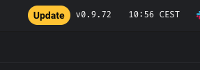

# Homework: LLM Orchestration and Ingestion

## Q1. Running Mage
### Q: What's the version of mage?
### A: `v0.9.72`



> **NOTE** Event though we were asked to execute command `docker pull mageai/mageai:llm` it is still not the latest release from [git](https://github.com/mage-ai/mage-ai/releases) as on [Docker Hub](https://hub.docker.com/layers/mageai/mageai/llm/images/sha256-f759787639dc3e6c65683602158d3f203afb9cb7a76d6e7789f9e9b8ef555e77?context=explore) this image was last time updated 19 days ago

## Q2. Reading the documents
Mage UI > New > Retrieval Augmented Generation > Load > Ingest > Custom Code

```python
import io

import requests
import docx

if 'data_loader' not in globals():
    from mage_ai.data_preparation.decorators import data_loader
if 'test' not in globals():
    from mage_ai.data_preparation.decorators import test


@data_loader
def load_data(*args, **kwargs):
    """
    Template code for loading data from any source.

    Returns:
        Anything (e.g. data frame, dictionary, array, int, str, etc.)
    """
    # Specify your data loading logic here

    faq_documents = {
        'llm-zoomcamp': '1qZjwHkvP0lXHiE4zdbWyUXSVfmVGzougDD6N37bat3E',
    }

    documents = []

    for course, file_id in faq_documents.items():
        print(course)
        course_documents = read_faq(file_id)
        documents.append({'course': course, 'documents': course_documents})

    print('Total documents', len(documents))
    print('Total course documents', len(documents[0]['documents']))
    return [documents]


@test
def test_output(output, *args) -> None:
    """
    Template code for testing the output of the block.
    """
    assert output is not None, 'The output is undefined'

def clean_line(line):
    line = line.strip()
    line = line.strip('\uFEFF')
    return line

def read_faq(file_id):
    url = f'https://docs.google.com/document/d/{file_id}/export?format=docx'
    
    response = requests.get(url)
    response.raise_for_status()
    
    with io.BytesIO(response.content) as f_in:
        doc = docx.Document(f_in)

    questions = []

    question_heading_style = 'heading 2'
    section_heading_style = 'heading 1'
    
    heading_id = ''
    section_title = ''
    question_title = ''
    answer_text_so_far = ''
     
    for p in doc.paragraphs:
        style = p.style.name.lower()
        p_text = clean_line(p.text)
    
        if len(p_text) == 0:
            continue
    
        if style == section_heading_style:
            section_title = p_text
            continue
    
        if style == question_heading_style:
            answer_text_so_far = answer_text_so_far.strip()
            if answer_text_so_far != '' and section_title != '' and question_title != '':
                questions.append({
                    'text': answer_text_so_far,
                    'section': section_title,
                    'question': question_title,
                })
                answer_text_so_far = ''
    
            question_title = p_text
            continue
        
        answer_text_so_far += '\n' + p_text
    
    answer_text_so_far = answer_text_so_far.strip()
    if answer_text_so_far != '' and section_title != '' and question_title != '':
        questions.append({
            'text': answer_text_so_far,
            'section': section_title,
            'question': question_title,
        })

    return questions
```
### Q: How many FAQ documents we processed?
### A: `1`

## Q3. Chunking
Mage UI > Open Pipeline > Transform > Chunking > Custom Code

```python
import hashlib

if 'transformer' not in globals():
    from mage_ai.data_preparation.decorators import transformer
if 'test' not in globals():
    from mage_ai.data_preparation.decorators import test


@transformer
def transform(data, *args, **kwargs):
    """
    Template code for a transformer block.

    Add more parameters to this function if this block has multiple parent blocks.
    There should be one parameter for each output variable from each parent block.

    Args:
        data: The output from the upstream parent block
        args: The output from any additional upstream blocks (if applicable)

    Returns:
        Anything (e.g. data frame, dictionary, array, int, str, etc.)
    """
    # Specify your transformation logic here
    
    documents = []
    course = data[0]['course']
    docs = data[0]['documents']

    for doc in docs:
        doc['course'] = course
        # previously we used just "id" for document ID
        doc['document_id'] = generate_document_id(doc)
        documents.append(doc)

    print('result',len(documents))

    return documents


@test
def test_output(output, *args) -> None:
    """
    Template code for testing the output of the block.
    """
    assert output is not None, 'The output is undefined'

def generate_document_id(doc):
    combined = f"{doc['course']}-{doc['question']}-{doc['text'][:10]}"
    hash_object = hashlib.md5(combined.encode())
    hash_hex = hash_object.hexdigest()
    document_id = hash_hex[:8]
    return document_id
```

### Q: How many documents (chunks) do we have in the output?
### A: `86`

## Q4. Export
```python
from typing import Dict, List, Tuple, Union

import numpy as np
from elasticsearch import Elasticsearch

from datetime import datetime

from mage_ai.data_preparation.variable_manager import set_global_variable

if 'data_exporter' not in globals():
    from mage_ai.data_preparation.decorators import data_exporter


@data_exporter
def elasticsearch(
    documents: List[Dict[str, Union[Dict, List[int], np.ndarray, str]]], *args, **kwargs,
):
    """
    Exports document data to an Elasticsearch database.
    """

    connection_string = kwargs.get('connection_string', 'http://localhost:9200')
    
    index_name_prefix = kwargs.get('index_name', 'documents')
    current_time = datetime.now().strftime("%Y%m%d_%M%S")
    index_name = f"{index_name_prefix}_{current_time}"
    print("index name:", index_name)
    set_global_variable('ultraviolet_nebula', 'index_name', index_name)

    number_of_shards = kwargs.get('number_of_shards', 1)
    number_of_replicas = kwargs.get('number_of_replicas', 0)
    vector_column_name = kwargs.get('vector_column_name', 'embedding')

    dimensions = kwargs.get('dimensions')
    if dimensions is None and len(documents) > 0:
        document = documents[0]
        dimensions = len(document.get(vector_column_name) or [])

    es_client = Elasticsearch(connection_string)

    print(f'Connecting to Elasticsearch at {connection_string}')

    index_settings = {
        "settings": {
            "number_of_shards": number_of_shards,
            "number_of_replicas": number_of_replicas
        },
        "mappings": {
            "properties": {
                "text": {"type": "text"},
                "section": {"type": "text"},
                "question": {"type": "text"},
                "course": {"type": "keyword"},
                "document_id": {"type": "keyword"}
            }
        }
    }

    if not es_client.indices.exists(index=index_name):
        es_client.indices.create(index=index_name)
        print('Index created with properties:', index_settings)
        print('Embedding dimensions:', dimensions)

    print(f'Indexing {len(documents)} documents to Elasticsearch index {index_name}')
    for document in documents:
        print(f'Indexing document {document["document_id"]}')

        es_client.index(index=index_name, document=document)

    print(document)
```
### Q: What's the last document id?
### A: `6fc3236a`

## Q5. Testing the retrieval
```python
from typing import Dict, List, Union
import os
import numpy as np
from elasticsearch import Elasticsearch, exceptions


@data_loader
def search(*args, **kwargs) -> List[Dict]:
    """
    query_embedding: Union[List[int], np.ndarray]
    """
    
    connection_string = kwargs.get('connection_string', 'http://localhost:9200')
    index_name = kwargs.get('index_name', 'documents')
    source = kwargs.get('source', "cosineSimilarity(params.query_vector, 'embedding') + 1.0")
    top_k = kwargs.get('top_k', 5)
    chunk_column = kwargs.get('chunk_column', 'content')
    index_name = "documents_20240818_1134"

    search_query = {
        "size": 5,
        "query": {
            "bool": {
                "must": {
                    "multi_match": {
                        "query": "When is the next cohort?",
                        "fields": ["question^3", "text", "section"],
                        "type": "best_fields"
                    }
                },
                "filter": {
                    "term": {
                        "course": "data-engineering-zoomcamp"
                    }
                }
            }
        }
    }

    print("Sending script query:", search_query)

    es_client = Elasticsearch(connection_string)
    
    try:
        response = es_client.search(index=index_name, body=search_query)

        print("Raw response from Elasticsearch:", response)

        return [hit['_source'][chunk_column] for hit in response['hits']['hits']]
    
    except exceptions.BadRequestError as e:
        print(f"BadRequestError: {e.info}")
        return []
    except Exception as e:
        print(f"Unexpected error: {e}")
        return []
```
### Q: When is the next cohort?
### A: ``

## Q6. Reindexing
### Q: When is the next cohort?
### A: `Summer 2026`