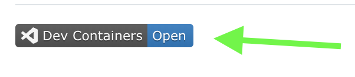

# LLM Zoomcamp June 2024

## Overview 

[LLM Zoomcamp June 2024](https://github.com/DataTalksClub/llm-zoomcamp) is a free online course about real-life applications of LLMs.

This repository will contain homeworks and notes that will be required during this course

## How to run in Dev Container (quick way)

☝️ Click to "DevContainers Open" ☝️

or follow instructions from [How to Run in Dev Container](./how-to/1-How-To-Run-Dev-Container.md)