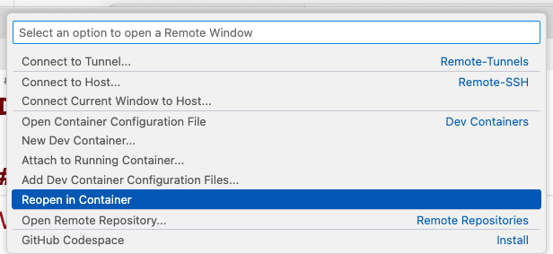

# Table of Contents  
* [Pre-Requisite](#pre-requisite)  
* [Overview](#overview)  
  * [Homework 1 - Installed Components](#home-work-1)
* [Configuration](#configuration)  
  * [OpenAI API Key](#openai-api-config)  
* [Run in Dev Container](#run-dev-container)  
* [Run applications](#run-apps)  
  * [Run Jupyter Notebook](#run-notebook)  

<a name="pre-requisite"/>

# Pre-Requisite
* [Visual Studio Code](https://code.visualstudio.com/)
* [Visual Studio Code - Remove Development Extension](https://marketplace.visualstudio.com/items?itemName=ms-vscode-remote.vscode-remote-extensionpack)
* Docker
* Docker Compose
* [Docker Desktop](https://www.docker.com/products/docker-desktop/)

<a name="overview"/>

# Overview

This project uses [Dev Container](https://containers.dev/) that is build with [Docker Compose](https://docs.docker.com/compose/) to include required software for homeworks

<a name="home-work-1"/>

## Homework 1 - Installed Components
* [Elastic Search](https://www.elastic.co/)
* [pipenv](pipenv)
* [Jupyter Notebooks](https://jupyter.org/)

<a name="configuration"/>

# Configuration

Below list of Environment Variables that will be required.

<a name="openai-api-config"/>

## OpenAI API Key

Before proceed it will be required to create `.env` file in `.devcontainer` folder. 

**NOTE**: `.env` file by default will be excluded from source control. Do not add it.

In `.env` file specify your OpenAI API Key as following

```env
OPENAI_API_KEY=...
```

<a name="run-dev-container"/>

# Run in  Dev Container

* Open VS Code
* Install extension [Remote Development](https://marketplace.visualstudio.com/items?itemName=ms-vscode-remote.vscode-remote-extensionpack) from Microsoft
* Open folder in VS Code. After that VS Code will suggest to open it Dev Container, as showed below. Agree and follow instructions.


* In case VS Code did not showed any popup, then we can manually reopen folder in Dev Container, as showed below. Use green link in the left bottom corner.


* In showed menu at top center choose "Reopen in container", as showed below



<a name="run-apps"/>

# Run applications

In some case it might require to run the following commands to install all software (in case it failed during building Dockerfile)

* `pipenv shell`
* `pipenv install`

<a name="run-make-apps"/>

## Run Jupyter Notebook

After VS Code reopens folder in Dev Container it will be possible to run Jupyter Notebook.

`jupyter notebook` - this command will run Jupter Notebook

Review command output to find `localhost` URL to open it in browser.
It should be something like this `http://localhost:8888/tree?token=...`